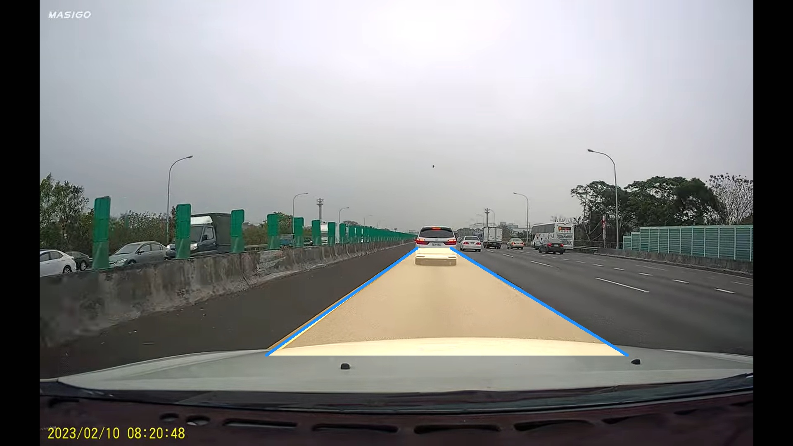
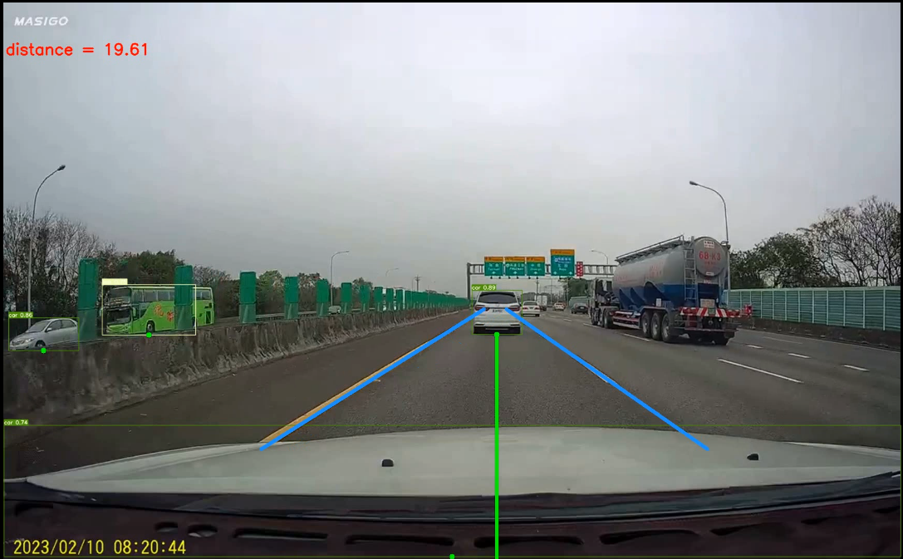

# Car-distance-estimation

### Introduction
> Use YOLO v7 to detect car, and estimate the distance of front car.

### This YOLO v7 source code is from
[YOLO v7 Source code](https://github.com/WongKinYiu/yolov7.git)

### How to run the code ?
```
python detect.py --weights yolov7.pt --conf 0.25 --img-size 640 --source your_image_or_video
```

### Result

* Car lane
  
* distance estimation
  
